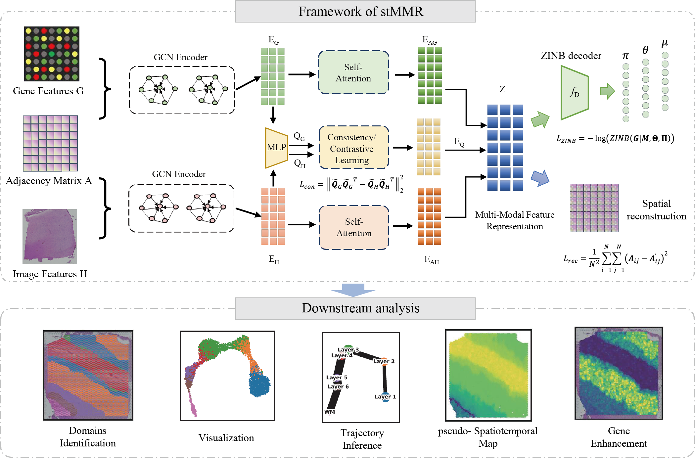

# stMMR: Multi-Modal Feature Representation in Spatial Transcriptomics with Similarity Contrastive Learning

## 1 Introduction

stMMR is a multimodal feature representation approach based on similarity contrastive learning, specifically designed for spatial transcriptomics. stMMR can effectively integrates gene expression, spatial location, and histological imaging information.

stMMR uses self-attention module for deep embedding of features within unimodal and incorporates similarity contrastive learning for integrating features across modalities. It demonstrates superior performances in multiple analyses using datasets generated by different platforms, including domain identification, developmental trajectory inference as well as enhancement of gene expression.

The flowchart of stMMR is shown in the following diagram.



## 2 Installation

stMMR is implemented using Python 3.9.1 and Pytorch 1.11.1.

Users can install stMMR through this repository directly or PyPI.

### 2.1 Install from Github

```
git clone https://github.com/nayu0419/stMMR.git
cd stMMR
python setup.py build
python setup.py install --user
```

### 2.2 Install from PyPI

```
pip3 install stMMR
```

### 2.3 Requirements

* numpy~=1.21.5
* numba~=0.55.1
* scanpy~=1.9.3
* torch~=1.11.0
* munkres~=1.1.4
* pandas~=1.3.5
* scikit-learn~=1.0.2
* anndata~=0.8.0
* scipy~=1.7.3
* matplotlib~=3.5.2

## 3 Datasets

All datasets used in this paper are publicly available. Users can download them from the links below.

* **DPLFC**  
The primary source: <https://github.com/LieberInstitute/spatialLIBD>.  
The processed version: <https://www.nature.com/articles/s41593-020-00787-0>.

* **Human breast cancer**  
The primary source: <https://www.10xgenomics.com/resources/datasets/human-breast-cancer-block-a-section-1-1-standard-1-1-0>.  
The processed version: <https://github.com/JinmiaoChenLab/SEDR_analyses/>.

* **Chicken heart**  
The primary source: <https://www.ncbi.nlm.nih.gov/geo/query/acc.cgi?acc=GSE149457>.

* **Lung cancer (9-1) nanostring**  
The primary source: <https://nanostring.com/products/cosmx-spatial-molecular-imager/nsclc-ffpe-dataset>.

* **Human pancreatic ductal adenocarcinoma**  
The primary source: <https://www.ncbi.nlm.nih.gov/geo/query/acc.cgi?acc=GSM3036911>.

* **Mouse anterior brain**  
The primary source: <https://www.10xgenomics.com/resources/datasets/mouse-brain-serial-section-1-sagittal-anterior-1-standard-1-1-0>.

## 4 Parameters and Tutorial

### 4.1 parameters of stMMR

    **--knn**: The number of clusters (This parameter is mandatory if the clustering method is k-means).
    
    **--hidden_dims**: The dimension of the encoder.
	
    **--n_epochs**: The number of training epochs.
    
    **--lr**: The learning rate for AdamOptimizer.
    
    **--random_seed**: the random parameter.
    
    **--res**: Clustering resolution (If the clustering method is leiden, this parameter is required).
	
    **--weight_decay**: The weight decay for AdamOptimizer.
    
    **--a**: The value of hyperparameter a for ZINB loss. 
    
    **--b**: The value of hyperparameter b for contrastive loss.
    
    **--c**: The value of hyperparameter c for regularization loss.
    
    **--cluster**: The tool for clustering. Supported tools include 'k-means' and 'leiden'. The default is 'k-means'.
        
    **--loss_type**: Type of loss function. Supported types include: 'contrastive loss' and 'consistency loss'. The default is 'consistency loss'.
	
    **--radius**：the spatial location radius.
      
    **--device**： See torch.device.
    
    **--dropout**: the dropout rate.


### 4.2 Example: Analyzing Human Breast Cancer ST data with stMMR

For the sake of reproducibility, we provide here the analysis code for the human breast cancer dataset used in the main text.

First, load the required packages and data.

```Python
import os
import csv
import re
import pandas as pd
import numpy as np
import scanpy as sc
import matplotlib.pyplot as plt
from sklearn.metrics.cluster import adjusted_rand_score
from stMMR.utils import *
from stMMR.process import *
from stMMR import train_model
from datetime import datetime

section_id = "V1_Breast_Cancer_Block_A_Section_1"
k = 20

im_re = pd.read_csv(
    os.path.join("Data", section_id,
                 "image_representation/VIT_pca_representation.csv"),
    header=0,
    index_col=0,
    sep=",",
)
print(section_id, k)

adata = sc.read_visium(
    "Data/V1_Breast_Cancer_Block_A_Section_1",
    count_file="V1_Breast_Cancer_Block_A_Section_1_filtered_feature_bc_matrix.h5",
)
```

Next, we preprocess the raw data. This involves ensuring the uniqueness of gene names and filtering out genes that exhibit minimal expression across cells. Subsequently, we identify and retain genes that are highly variable. The data is then subjected to normalization and logarithmic transformation. The adjacent matrix is caulculated.

```Python

adata.var_names_make_unique()
prefilter_genes(adata, min_cells=3)  # avoiding all genes are zeros
# prefilter_specialgenes(adata)
sc.pp.highly_variable_genes(adata, flavor="seurat_v3", n_top_genes=3000)
sc.pp.normalize_per_cell(adata)
sc.pp.log1p(adata)
adata.obsm["im_re"] = im_re

Ann_df = pd.read_csv(
    "Data/V1_Breast_Cancer_Block_A_Section_1/metadata.tsv",
    sep=" ",
    header=0,
    na_filter=False,
    index_col=0,
)
adata.obs["Ground Truth"] = Ann_df.loc[adata.obs_names, "fine_annot_type"]
adata.obs["ground_truth"] = adata.obs["Ground Truth"]
adata = adata[:, adata.var["highly_variable"]]

adata.obsm["adj"] = calculate_adj_matrix(adata)

```

Configure the parameters for stMMR.

```Python
adata = train_model.train(adata, k, n_epochs=50, h=[3000, 3000], radius=50, l=0.63, lr=0.0000005)

obs_df = adata.obs.dropna()
# obs_df.to_csv("result/{}_type_stMMR.csv".format(section_id))
ARI = adjusted_rand_score(obs_df["stMMR"], obs_df["Ground Truth"])
print("Adjusted rand index = %.5f" % ARI)


plt.rcParams["figure.figsize"] = (3, 3)
sc.pl.spatial(
    adata,
    color=["stMMR", "Ground Truth"],
    title=["stMMR (ARI=%.2f)" % ARI, "Ground Truth"],
    save=section_id,
)

```

**Note**:  
In our study, we employed the [Vision Transformer (ViT)](https://github.com/google-research/vision_transformer) model to extract the latent representations of each spot image. As a case study, we utilized the Human Breast Cancer dataset. The corresponding histology image can be accessed at the provided link: <https://www.10xgenomics.com/resources/datasets/human-breast-cancer-block-a-section-1-1-standard-1-1-0>. To minimize waiting time, we have uploaded the processed histological image representation data to the following Google Drive link: <https://drive.google.com/drive/folders/12udlvJ_VyvU5l3mJOOuHO5VOkCqwWaRI>.

## Contact

For any issues regarding the packages, please do not hesitate to submit an issue or contact us at <gaorui@sdu.edu.cn> and <zw@sdu.edu.cn>.
